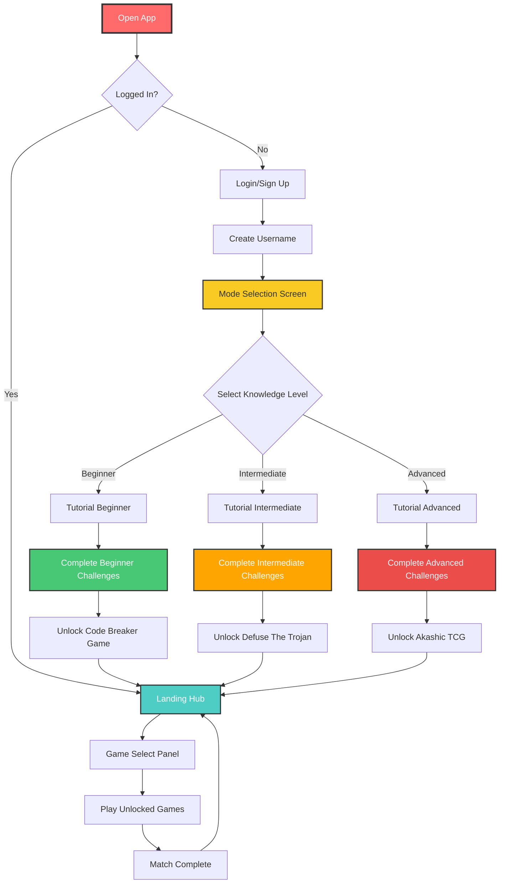
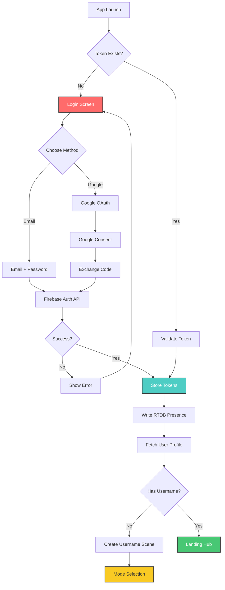
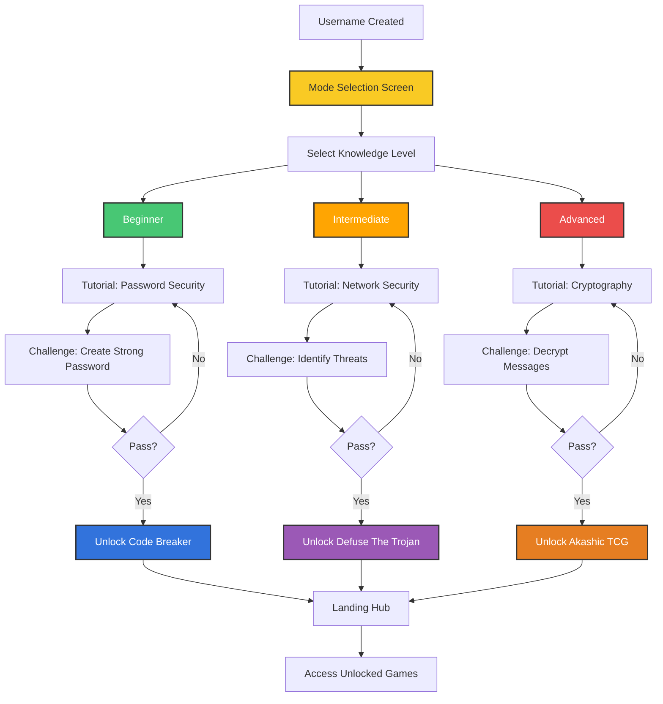
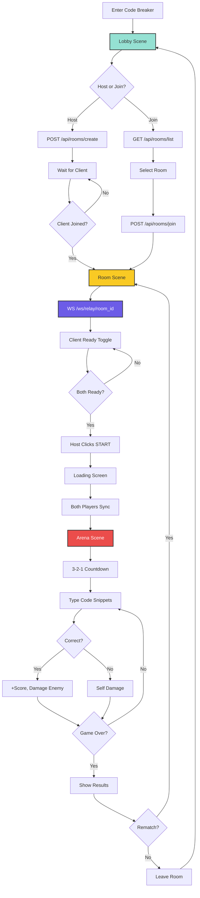
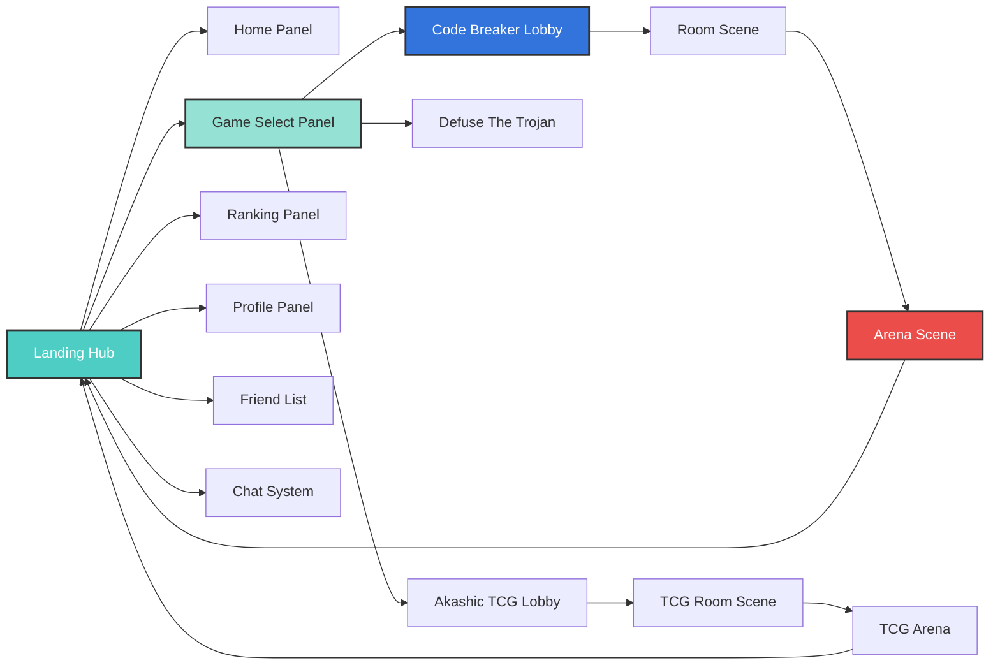
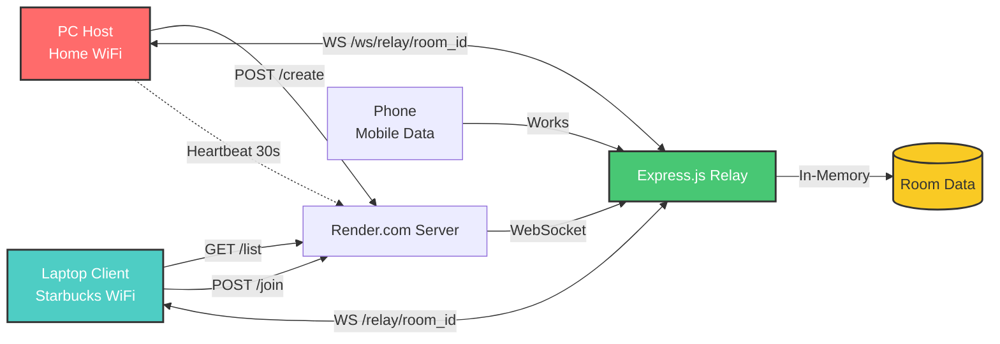
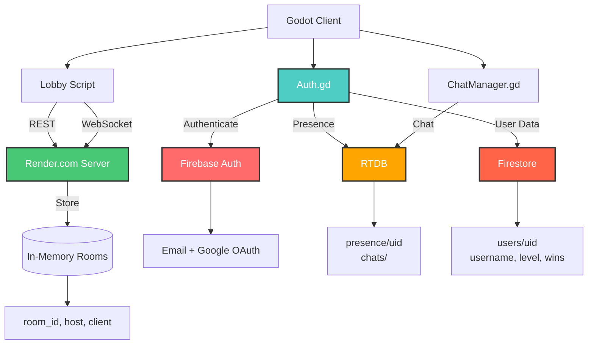
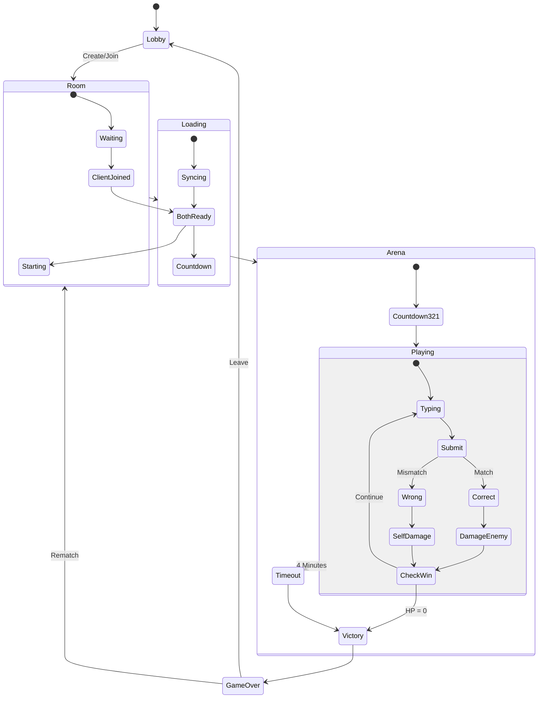
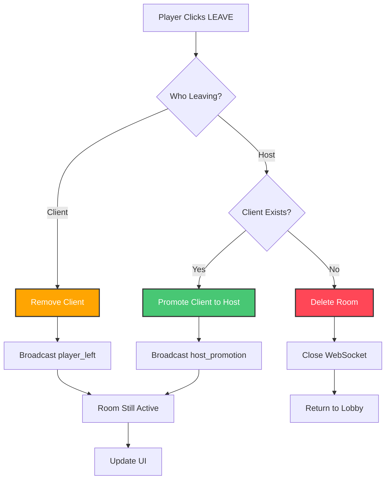

# Capstone 2 - Complete System Flow (Cyber Security Game Platform)

## Instructions for draw.io Import:
1. Go to **https://app.diagrams.net/**
2. Click **Arrange → Insert → Advanced → Mermaid**
3. Copy ONE diagram below (WITHOUT the ```mermaid wrapper)
4. Paste and click **Insert**
5. Diagram appears as editable elements!

---

## 1. Complete User Journey (Tutorial Unlock System)



---

## 2. Authentication Flow (Firebase)



---

## 3. Mode Selection & Tutorial Unlock System



---

## 4. Code Breaker Multiplayer Flow (WebSocket Relay)



---

## 5. Landing Hub Navigation



---

## 6. WebSocket Relay Architecture (No Port Forwarding)



---

## 7. Data Storage Architecture



---

## 8. Arena Gameplay State Machine



---

## 9. Leave Room Logic (Host Promotion)



---

## Key Features

✅ **Tutorial Unlock System:** Complete tutorials to unlock specific games  
✅ **Knowledge Levels:** Beginner, Intermediate, Advanced (each unlocks different game)  
✅ **Cross-Network Multiplayer:** No port forwarding (WebSocket relay)  
✅ **Real-time Chat:** RTDB polling system  
✅ **Profile System:** Track stats, level, wins, losses  
✅ **Scene Preservation:** WebSocket relay persists across scene changes  

---

## How to Use

### Import to draw.io:
1. Go to https://app.diagrams.net/
2. Click **Arrange → Insert → Advanced → Mermaid**
3. Copy ONE diagram code (without ` ```mermaid ` wrapper)
4. Paste and click Insert
5. Edit as needed!

### Export to PNG:
1. Select diagram
2. **File → Export as → PNG**
3. Adjust settings (zoom: 100%, border: 10px)
4. Save to `docs/flowcharts/`
