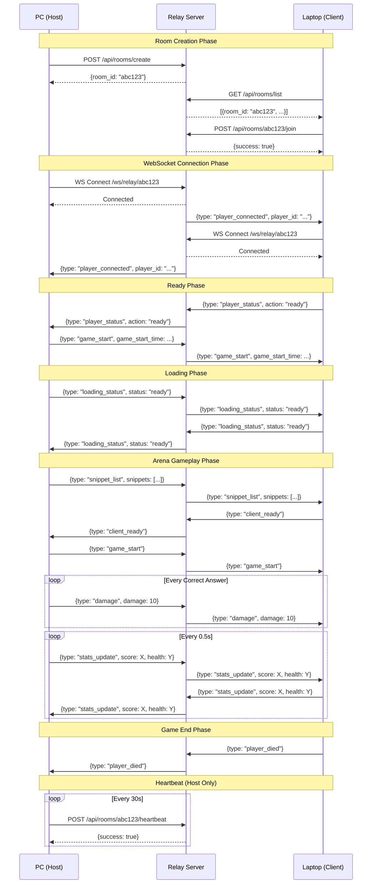
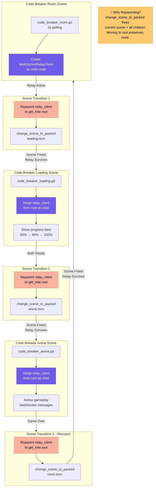
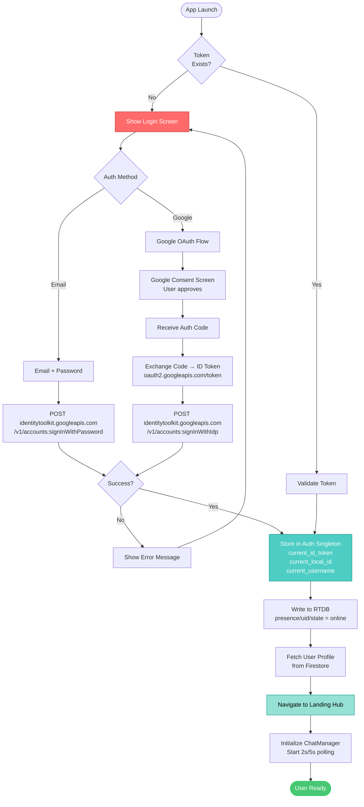
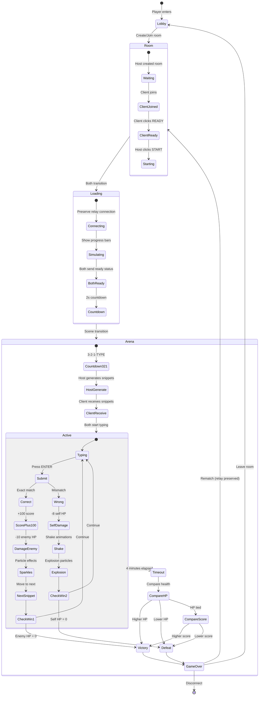
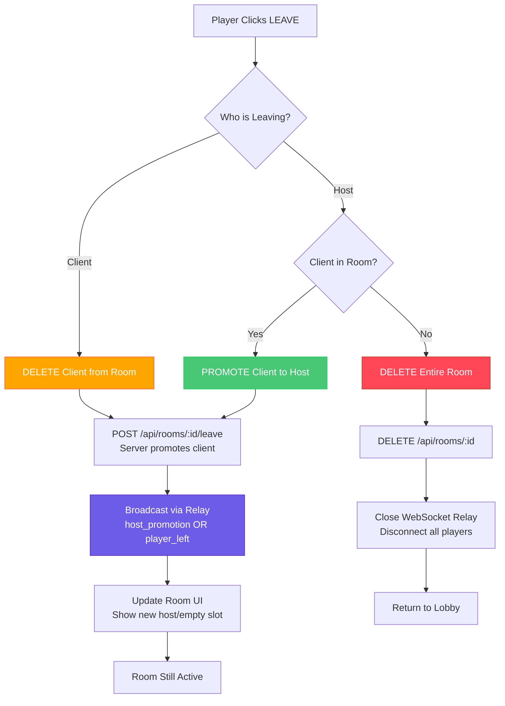

# System Architecture Flowchart

## Complete System Flow

```mermaid
flowchart TD
	Start([User Opens App]) --> Auth{Authenticated?}
	
	Auth -->|No| Login[Login/Signup Screen]
	Login --> FirebaseAuth[Firebase Authentication]
	FirebaseAuth --> EmailPass[Email + Password]
	FirebaseAuth --> GoogleOAuth[Google OAuth]
	
	EmailPass --> SetPresence[Set Online Presence<br/>RTDB]
	GoogleOAuth --> SetPresence
	
	Auth -->|Yes| Landing[Landing Hub Scene<br/>Social Platform]
	SetPresence --> Landing
	
	Landing --> Profile[User Profile<br/>Avatar/Level/Stats]
	Landing --> FriendList[Friend List]
	Landing --> Chat[Real-time Chat<br/>ChatManager 2s/5s polling]
	Landing --> GameSelect[Game Selection Panel]
	
	GameSelect --> CB[Code Breaker]
	GameSelect --> TCG[Akashic TCG]
	
	%% Code Breaker Flow
	CB --> CBLobby[Code Breaker Lobby<br/>5s polling]
	CBLobby --> CreateRoom[Host: Create Room]
	CBLobby --> JoinRoom[Client: Join Room]
	
	CreateRoom --> WakeServer[Ping Render Server<br/>Wake if sleeping]
	WakeServer --> RegisterRoom[POST /api/rooms/create<br/>No IP/port needed]
	RegisterRoom --> RoomID[Receive room_id]
	
	JoinRoom --> PollRooms[GET /api/rooms/list<br/>See available rooms]
	PollRooms --> SelectRoom[Client selects room]
	SelectRoom --> JoinAPI[POST /api/rooms/:id/join]
	
	RoomID --> CBRoom[Code Breaker Room<br/>2s polling]
	JoinAPI --> CBRoom
	
	CBRoom --> ConnectRelay[Both connect to<br/>WS /ws/relay/:room_id]
	ConnectRelay --> Heartbeat[Host: 30s heartbeat<br/>POST /api/rooms/:id/heartbeat]
	
	CBRoom --> ClientReady{Client Ready?}
	ClientReady -->|No| WaitReady[Wait for ready status<br/>via relay message]
	WaitReady --> ClientReady
	ClientReady -->|Yes| HostStart[Host: START MATCH]
	
	HostStart --> SendStart[Send game_start<br/>relay message]
	SendStart --> ReparentRoom[Reparent relay_client<br/>to scene root]
	ReparentRoom --> LoadingScene[Code Breaker Loading]
	
	LoadingScene --> AdoptRelay1[Adopt relay_client<br/>from root]
	AdoptRelay1 --> ShowProgress[Show player cards<br/>Progress bars 30→60→100%]
	ShowProgress --> SendReady[Send loading_status: ready]
	SendReady --> WaitOpponent{Opponent Ready?}
	WaitOpponent -->|No, <30s| WaitOpponent
	WaitOpponent -->|Yes| Countdown2s[2s countdown]
	WaitOpponent -->|Timeout 30s| BackToRoom1[Return to Room]
	
	Countdown2s --> ReparentLoading[Reparent relay_client<br/>to scene root]
	ReparentLoading --> ArenaScene[Code Breaker Arena]
	
	ArenaScene --> AdoptRelay2[Adopt relay_client<br/>from root]
	AdoptRelay2 --> Countdown3[3-2-1-TYPE Countdown<br/>Bounce animations]
	Countdown3 --> PauseTimer[Timer paused]
	PauseTimer --> HostSnippet{Is Host?}
	
	HostSnippet -->|Yes| GenSnippets[Generate snippet list<br/>GDScript code]
	GenSnippets --> SendSnippets[Send snippet_list<br/>via relay]
	SendSnippets --> StartTimer[Start 4-min timer]
	
	HostSnippet -->|No| ReceiveSnippets[Receive snippets<br/>from host]
	ReceiveSnippets --> SendClientReady[Send client_ready]
	SendClientReady --> StartTimer
	
	StartTimer --> FadeMusic[Battle music<br/>fade in -80dB → -5dB]
	FadeMusic --> Gameplay[Active Gameplay Loop]
	
	Gameplay --> TypeSubmit[Type code in LineEdit<br/>Press ENTER to submit]
	TypeSubmit --> CheckMatch{Exact Match?}
	
	CheckMatch -->|Yes Correct| AddScore[+100 score<br/>self]
	AddScore --> DamageEnemy[Send damage message<br/>-10 enemy HP]
	DamageEnemy --> Sparkles[Success sparkle<br/>particles 15]
	Sparkles --> NextSnippet[Move to next snippet<br/>index++]
	
	CheckMatch -->|No Wrong| SelfDamage[-8 self HP]
	SelfDamage --> Penalty[Score penalty]
	Penalty --> Shake[Shake animations<br/>health bar + screen]
	Shake --> Explosion[Explosion particles<br/>12-25 depending on HP]
	
	NextSnippet --> SendStats[Send stats_update<br/>every 0.5s]
	Explosion --> SendStats
	SendStats --> CheckEnd{Game End?}
	
	CheckEnd -->|HP = 0| PlayerDied[Send player_died<br/>message]
	CheckEnd -->|Finished All| PlayerFinished[Send player_finished<br/>message]
	CheckEnd -->|Timer = 0| Timeout[Compare HP then score]
	CheckEnd -->|Continue| Gameplay
	
	PlayerDied --> GameOver[Game Over Screen]
	PlayerFinished --> GameOver
	Timeout --> GameOver
	
	GameOver --> ReturnRoom[Return to Room<br/>Relay preserved]
	ReturnRoom --> Rematch{Rematch?}
	Rematch -->|Yes| ReparentArena[Reparent relay_client<br/>to root]
	ReparentArena --> CBRoom
	Rematch -->|No| LeaveRoom[Leave Room]
	
	LeaveRoom --> LeaveLogic{Who Leaves?}
	LeaveLogic -->|Host Alone| DeleteRoom[DELETE room<br/>Close relay]
	LeaveLogic -->|Client Leaves| RemoveClient[DELETE client<br/>Keep room alive]
	LeaveLogic -->|Host + Client| PromoteClient[PROMOTE client to host<br/>Keep room alive]
	
	DeleteRoom --> CBLobby
	RemoveClient --> CBRoom
	PromoteClient --> CBRoom
	
	%% Akashic TCG Flow
	TCG --> TCGLobby[Akashic TCG Lobby<br/>In Progress]
	TCGLobby --> TCGRoom[Akashic TCG Room<br/>In Progress]
	
	%% Styling
	classDef authStyle fill:#ff6b6b,stroke:#c92a2a,color:#fff
	classDef socialStyle fill:#4ecdc4,stroke:#0d9488,color:#fff
	classDef lobbyStyle fill:#95e1d3,stroke:#0d9488,color:#000
	classDef roomStyle fill:#f9ca24,stroke:#f0932b,color:#000
	classDef arenaStyle fill:#eb4d4b,stroke:#c23616,color:#fff
	classDef relayStyle fill:#6c5ce7,stroke:#5f27cd,color:#fff
	classDef decisionStyle fill:#a29bfe,stroke:#6c5ce7,color:#000
	
	class Login,FirebaseAuth,EmailPass,GoogleOAuth,SetPresence authStyle
	class Landing,Profile,FriendList,Chat,GameSelect socialStyle
	class CBLobby,CreateRoom,JoinRoom,WakeServer,RegisterRoom,PollRooms lobbyStyle
	class CBRoom,ClientReady,WaitReady,HostStart,Heartbeat roomStyle
	class ArenaScene,Gameplay,TypeSubmit,AddScore,DamageEnemy,SelfDamage,GameOver arenaStyle
	class ConnectRelay,SendStart,ReparentRoom,AdoptRelay1,AdoptRelay2,ReparentLoading,ReparentArena relayStyle
	class Auth,CheckMatch,CheckEnd,HostSnippet,WaitOpponent,Rematch,LeaveLogic decisionStyle
```



## WebSocket Relay Architecture

```mermaid
flowchart LR
	subgraph Players
		PC[PC - Home WiFi<br/>mark2<br/>Host]
		Laptop[Laptop - Starbucks<br/>Mark123456<br/>Client]
		Phone[Phone - Mobile Data<br/>Player3<br/>Observer]
	end
	
	subgraph Render[Render.com Cloud Server<br/>codebreaker-lobby.onrender.com]
		REST[REST API<br/>Express.js]
		WS[WebSocket Relay<br/>express-ws]
		Memory[(In-Memory<br/>Room Storage)]
		
		REST --> Memory
		WS --> Memory
	end
	
	PC -->|POST /api/rooms/create| REST
	REST -->|room_id: abc123| PC
	
	Laptop -->|GET /api/rooms/list| REST
	REST -->|rooms: [abc123]| Laptop
	Laptop -->|POST /api/rooms/:id/join| REST
	
	PC <-->|WS /ws/relay/abc123<br/>Gameplay Messages| WS
	Laptop <-->|WS /ws/relay/abc123<br/>Gameplay Messages| WS
	
	PC -.->|POST /api/rooms/:id/heartbeat<br/>every 30s| REST
	
	Phone x--x|❌ Blocked by NAT/Firewall<br/>in Direct P2P| PC
	Phone -->|✅ Works via Relay| WS
	
	style REST fill:#48c774,stroke:#23d160,color:#fff
	style WS fill:#3273dc,stroke:#2366d1,color:#fff
	style Memory fill:#ffdd57,stroke:#ffd324,color:#000
	style PC fill:#ff6b6b,stroke:#c92a2a,color:#fff
	style Laptop fill:#4ecdc4,stroke:#0d9488,color:#fff
	style Phone fill:#95e1d3,stroke:#0d9488,color:#000
```

## Relay Message Flow



## Scene Navigation & Relay Preservation



## Data Storage Architecture

```mermaid
flowchart TD
	subgraph Firebase[Firebase Backend]
		subgraph RTDB[Realtime Database<br/>capstone-823dc-default-rtdb]
			Presence[presence/uid<br/>state: online/offline<br/>last_seen: timestamp]
			Chats[chats/user_a_user_b/messages<br/>sender, text, timestamp, seen]
		end
		
		subgraph Firestore[Firestore Database<br/>capstone-823dc]
			Users[users/uid<br/>username, avatar, level<br/>wins, losses, xp]
		end
		
		subgraph Auth[Firebase Authentication]
			EmailAuth[Email + Password]
			GoogleAuth[Google OAuth]
		end
	end
	
	subgraph RenderServer[Render.com Server<br/>In-Memory Storage]
		Rooms[rooms Map<br/>room_id → Room Object]
		RoomData[Room: {<br/>  host: {...},<br/>  client: {...},<br/>  status,<br/>  created_at,<br/>  last_heartbeat<br/>}]
		Rooms --> RoomData
	end
	
	subgraph GodotClient[Godot Client]
		AuthSingleton[Auth.gd Singleton<br/>current_id_token<br/>current_local_id<br/>current_username]
		ChatManager[ChatManager.gd<br/>2s current chat<br/>5s unread counts]
		
		AuthSingleton -->|Write| Presence
		AuthSingleton -->|Read/Write| Users
		AuthSingleton -->|Authenticate| EmailAuth
		AuthSingleton -->|Authenticate| GoogleAuth
		
		ChatManager -->|Poll| Chats
		ChatManager -->|Write| Chats
		
		LobbyScript[code_breaker_lobby.gd<br/>5s polling]
		RoomScript[code_breaker_room.gd<br/>2s polling + 30s heartbeat]
		
		LobbyScript -->|HTTP REST| Rooms
		RoomScript -->|HTTP REST| Rooms
		RoomScript -->|WebSocket| RenderServer
	end
	
	style RTDB fill:#ffa502,stroke:#ff6348,color:#fff
	style Firestore fill:#ff6348,stroke:#ff4757,color:#fff
	style Auth fill:#ff6b6b,stroke:#c92a2a,color:#fff
	style Rooms fill:#48c774,stroke:#23d160,color:#fff
	style AuthSingleton fill:#4ecdc4,stroke:#0d9488,color:#fff
	style ChatManager fill:#95e1d3,stroke:#0d9488,color:#000
```

## Authentication Flow



## Code Breaker Gameplay Mechanics



## Leave Room Logic


