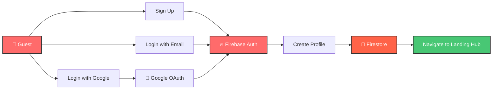
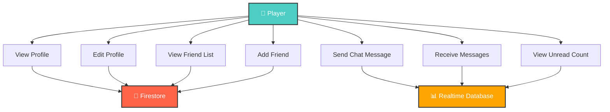
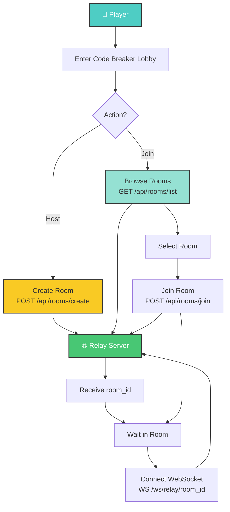
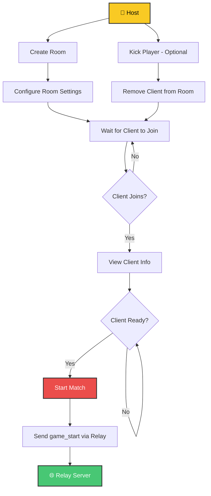
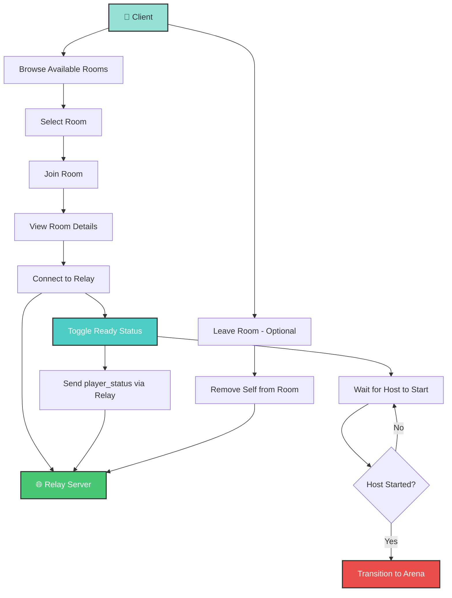
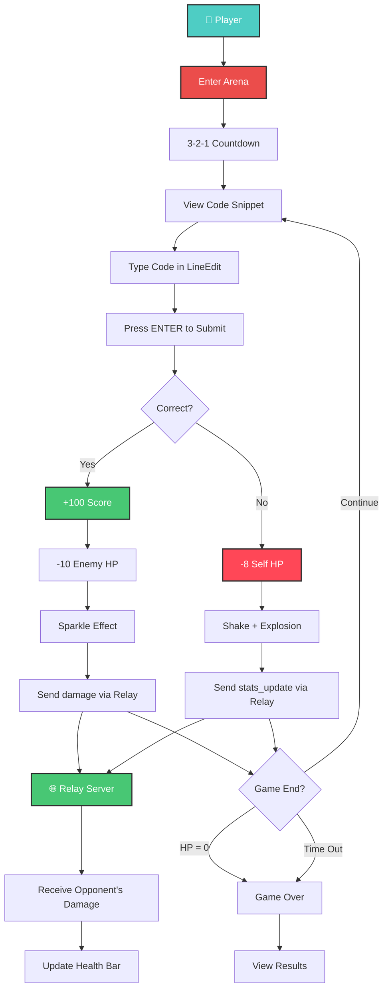
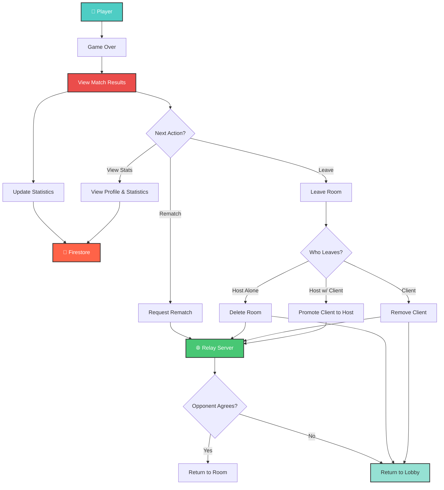

# Use Case Diagram - Code Breaker Multiplayer Platform

## Complete System Use Case Diagram

```mermaid
graph TB
    subgraph Actors
        Guest[👤 Guest User]
        Player[👤 Registered Player]
        Host[👤 Game Host]
        Client[👤 Game Client]
    end
    
    subgraph "Authentication System"
        UC1[Sign Up]
        UC2[Login with Email]
        UC3[Login with Google]
        UC4[Logout]
    end
    
    subgraph "Social Features"
        UC5[View Profile]
        UC6[Edit Profile]
        UC7[Add Friend]
        UC8[View Friend List]
        UC9[Send Chat Message]
        UC10[Receive Chat Message]
        UC11[View Unread Messages]
    end
    
    subgraph "Lobby Management"
        UC12[Browse Available Rooms]
        UC13[Create Game Room]
        UC14[Join Game Room]
        UC15[Leave Room]
        UC16[View Room Details]
    end
    
    subgraph "Room Operations - Host"
        UC17[Set Room Settings]
        UC18[Wait for Client]
        UC19[Start Match]
        UC20[Kick Player]
    end
    
    subgraph "Room Operations - Client"
        UC21[View Room Info]
        UC22[Toggle Ready Status]
        UC23[Wait for Host Start]
    end
    
    subgraph "Gameplay - Code Breaker"
        UC24[View Code Snippet]
        UC25[Type Code]
        UC26[Submit Answer]
        UC27[Deal Damage]
        UC28[Receive Damage]
        UC29[View Score]
        UC30[View Health]
        UC31[Win Match]
        UC32[Lose Match]
    end
    
    subgraph "Post-Game"
        UC33[View Game Results]
        UC34[Request Rematch]
        UC35[Return to Lobby]
        UC36[View Statistics]
    end
    
    subgraph "External Systems"
        Firebase[🔥 Firebase Auth]
        RTDB[📊 Realtime Database]
        Firestore[💾 Firestore]
        RelayServer[🌐 Relay Server]
    end
    
    %% Guest Interactions
    Guest --> UC1
    Guest --> UC2
    Guest --> UC3
    
    %% Player Interactions
    Player --> UC2
    Player --> UC3
    Player --> UC4
    Player --> UC5
    Player --> UC6
    Player --> UC7
    Player --> UC8
    Player --> UC9
    Player --> UC10
    Player --> UC11
    Player --> UC12
    Player --> UC13
    Player --> UC14
    Player --> UC15
    Player --> UC16
    
    %% Host Interactions
    Host --> UC13
    Host --> UC17
    Host --> UC18
    Host --> UC19
    Host --> UC20
    
    %% Client Interactions
    Client --> UC14
    Client --> UC21
    Client --> UC22
    Client --> UC23
    
    %% Both Host and Client in Arena
    Host --> UC24
    Host --> UC25
    Host --> UC26
    Host --> UC27
    Host --> UC28
    Host --> UC29
    Host --> UC30
    Host --> UC31
    Host --> UC32
    
    Client --> UC24
    Client --> UC25
    Client --> UC26
    Client --> UC27
    Client --> UC28
    Client --> UC29
    Client --> UC30
    Client --> UC31
    Client --> UC32
    
    %% Post-Game
    Host --> UC33
    Host --> UC34
    Host --> UC35
    Host --> UC36
    
    Client --> UC33
    Client --> UC34
    Client --> UC35
    Client --> UC36
    
    %% External System Connections
    UC1 -.->|authenticate| Firebase
    UC2 -.->|authenticate| Firebase
    UC3 -.->|authenticate| Firebase
    UC4 -.->|sign out| Firebase
    
    UC5 -.->|read| Firestore
    UC6 -.->|write| Firestore
    UC7 -.->|write| Firestore
    UC8 -.->|read| Firestore
    
    UC9 -.->|write| RTDB
    UC10 -.->|read| RTDB
    UC11 -.->|read| RTDB
    
    UC12 -.->|GET /api/rooms/list| RelayServer
    UC13 -.->|POST /api/rooms/create| RelayServer
    UC14 -.->|POST /api/rooms/join| RelayServer
    UC15 -.->|POST /api/rooms/leave| RelayServer
    
    UC19 -.->|WebSocket relay| RelayServer
    UC24 -.->|WebSocket relay| RelayServer
    UC25 -.->|WebSocket relay| RelayServer
    UC26 -.->|WebSocket relay| RelayServer
    UC27 -.->|WebSocket relay| RelayServer
    UC28 -.->|WebSocket relay| RelayServer
    
    UC33 -.->|write| Firestore
    UC36 -.->|read| Firestore
    
    %% Styling
    style Guest fill:#ff6b6b,stroke:#c92a2a,color:#fff
    style Player fill:#4ecdc4,stroke:#0d9488,color:#fff
    style Host fill:#f9ca24,stroke:#f0932b,color:#000
    style Client fill:#95e1d3,stroke:#0d9488,color:#000
    
    style Firebase fill:#ff6b6b,stroke:#c92a2a,color:#fff
    style RTDB fill:#ffa502,stroke:#ff6348,color:#fff
    style Firestore fill:#ff6348,stroke:#ff4757,color:#fff
    style RelayServer fill:#48c774,stroke:#23d160,color:#fff
```



---

## Detailed Use Cases by Feature

### 1. Authentication System



### 2. Social Features



### 3. Game Lobby Flow



### 4. Host Operations



### 5. Client Operations



### 6. Arena Gameplay



### 7. Post-Game Flow



---

## Actor Descriptions

| Actor | Role | Capabilities |
|-------|------|--------------|
| **Guest User** | Unauthenticated visitor | Can sign up or login only |
| **Registered Player** | Authenticated user | Access all social features, browse lobbies, view profile |
| **Game Host** | Room creator | Create rooms, configure settings, start matches, kick players |
| **Game Client** | Room joiner | Join rooms, toggle ready status, participate in matches |

---

## Use Case Priority Matrix

### Critical (Must Have)
- ✅ UC1: Sign Up
- ✅ UC2: Login with Email
- ✅ UC3: Login with Google
- ✅ UC12: Browse Available Rooms
- ✅ UC13: Create Game Room
- ✅ UC14: Join Game Room
- ✅ UC19: Start Match
- ✅ UC24-32: Core Gameplay

### High Priority (Should Have)
- ✅ UC5: View Profile
- ✅ UC9: Send Chat Message
- ✅ UC10: Receive Chat Message
- ✅ UC15: Leave Room
- ✅ UC33: View Game Results
- ✅ UC34: Request Rematch

### Medium Priority (Nice to Have)
- ⏳ UC6: Edit Profile
- ⏳ UC7: Add Friend
- ⏳ UC8: View Friend List
- ⏳ UC11: View Unread Messages
- ⏳ UC36: View Statistics

### Future Enhancements
- 🔮 UC20: Kick Player
- 🔮 Tournament Mode
- 🔮 Ranked Matches
- 🔮 Achievements System

---

## System Boundaries

### Client-Side (Godot)
- Authentication UI
- Social features UI
- Lobby browser
- Room management
- Arena gameplay
- Real-time rendering

### Server-Side (Render.com)
- Room registry (in-memory)
- WebSocket relay
- REST API endpoints
- Heartbeat monitoring

### External Services
- Firebase Auth (authentication)
- Firestore (user profiles, stats)
- Realtime Database (chat, presence)

---

## Import Instructions for app.diagrams.net

1. Go to **https://app.diagrams.net/**
2. Click **Arrange → Insert → Advanced → Mermaid**
3. Copy ONE diagram from above (without ` ```mermaid ` wrapper)
4. Click **Insert**
5. Diagram becomes editable!

**Note:** The main "Complete System Use Case Diagram" provides a high-level overview, while the detailed diagrams show specific user flows for each feature area.
