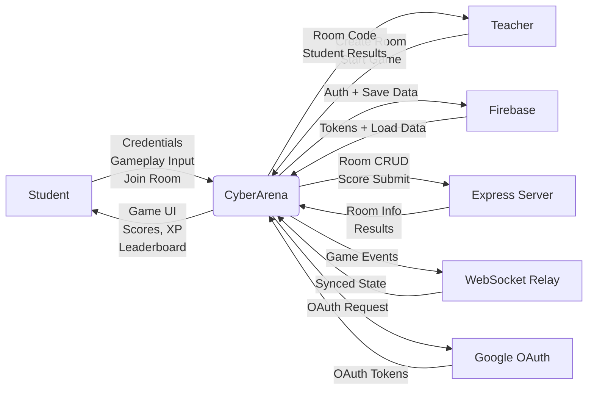
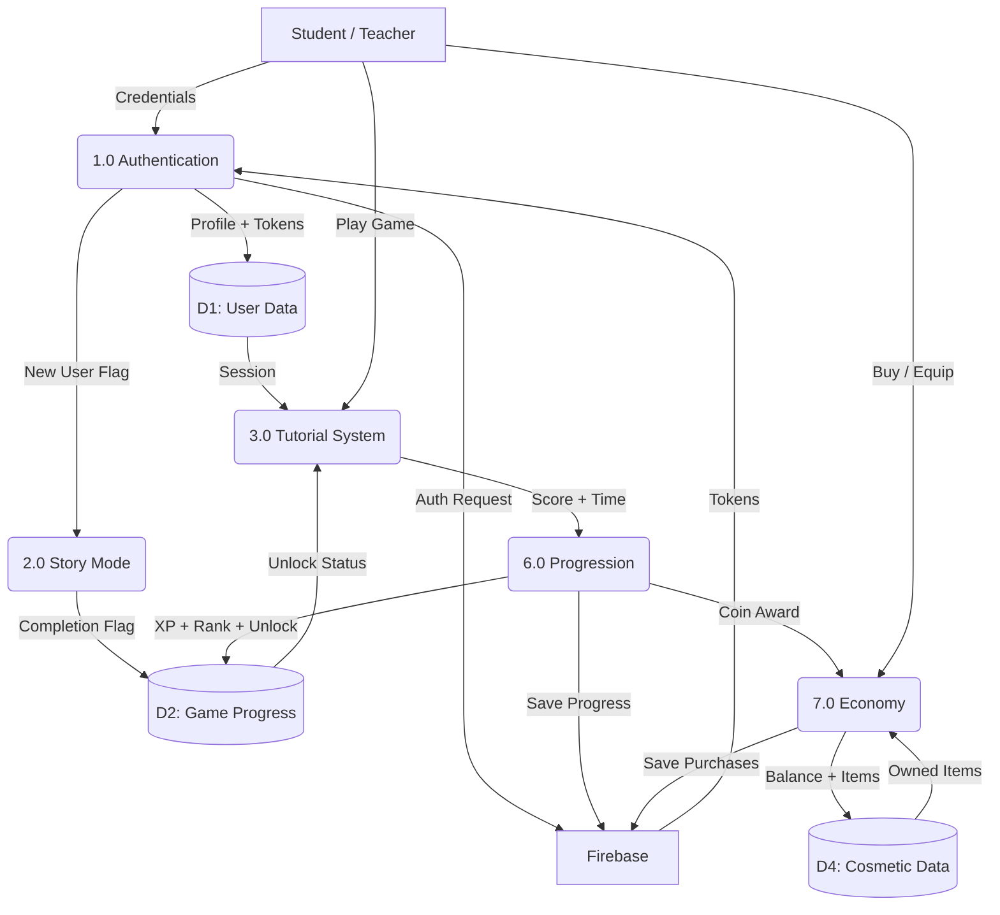
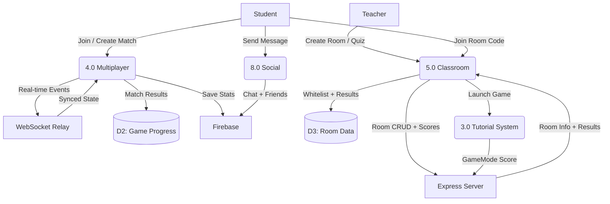
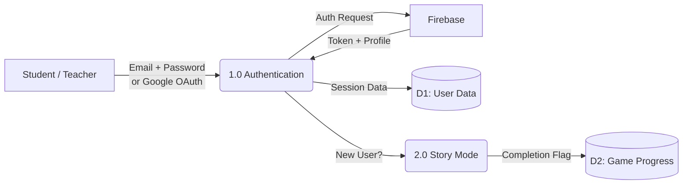
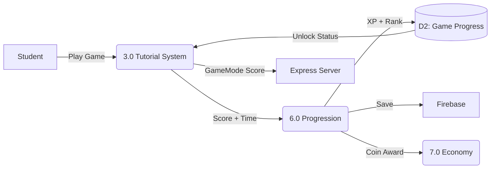
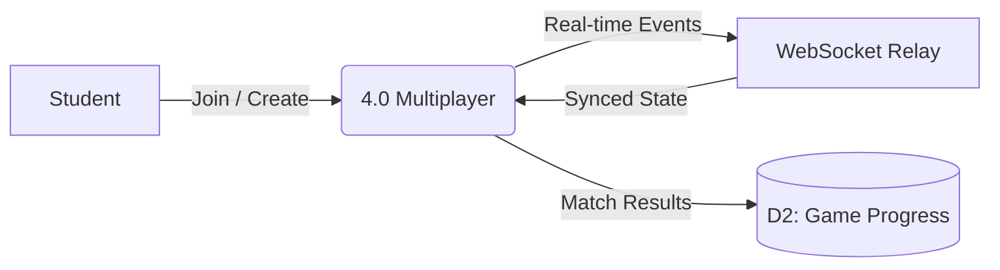
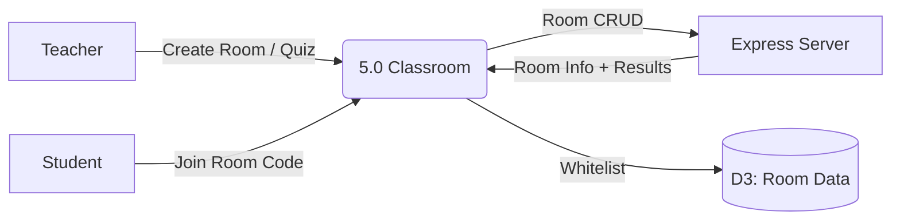
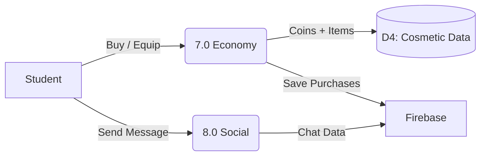
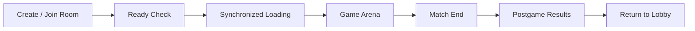
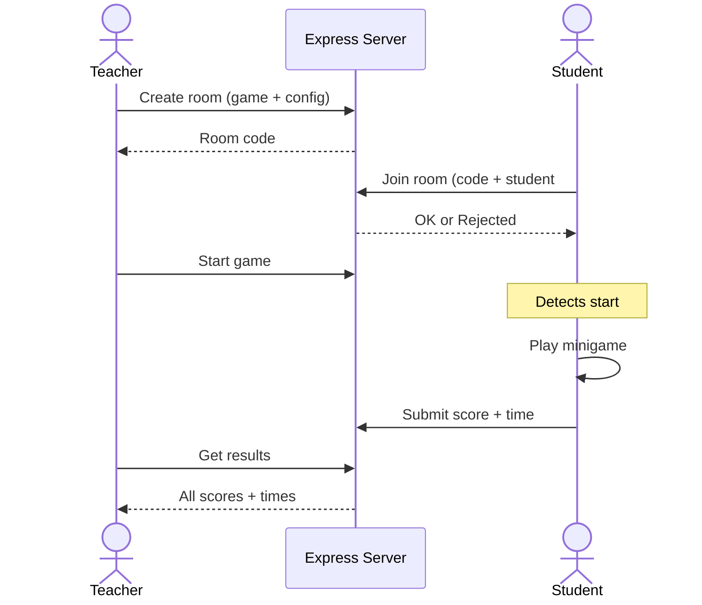

# CyberArena — Context Diagrams & Data Flow Diagrams

**Separate, compact Mermaid diagrams — each fits on one document page.**

### Diagram Level Guide

| Level | What It Shows | Diagrams |
|-------|---------------|----------|
| **Level 0** | Context Diagram — entire system as one box with external entities | Diagram 1 |
| **Level 1** | Data Flow Diagram — all internal processes, data stores, and data flows between them | Diagrams 2A, 2B |
| **Level 2** | Subsystem Decomposition — each process broken out with its own inputs, outputs, and stores | Diagrams 3–7 |
| **Level 3** | Detailed Process Flow — step-by-step sequences within a single process | Diagrams 8–9 |

### DFD Shape Legend

| Shape | Meaning | Mermaid Syntax |
|-------|---------|----------------|
| **Rectangle** `[ ]` | External Entity (actor or external system) | `A["Firebase"]` |
| **Rounded Rectangle** `( )` | Process (internal subsystem) | `A("1.0 Authentication")` |
| **Cylinder** `[( )]` | Data Store | `A[("D1: User Data")]` |
| **Labeled Arrow** `-->` | Data Flow (with label describing data) | `-->\|"Tokens"\|` |

---

## Diagram 1 — Level 0: System Context

Shows CyberArena as one box with all external actors and services around it.

**Summary:** The Level 0 Context Diagram shows CyberArena as a centralized educational game platform with two primary actors and four external services. **Students** are the main users who provide login credentials, gameplay input (typing, clicking, dragging), and room join requests; in return they receive the game interface, XP/score updates, rank progression, and leaderboard results. **Teachers** create game rooms or multiple-choice quizzes, configure settings (game type, player count, student whitelist), and start sessions; they receive generated room codes, a live player list with avatars and ranks, and real-time student score results. On the backend, **Firebase** handles all authentication (email/password registration, login, token refresh) and serves as the persistent database via Cloud Firestore, storing user profiles, tutorial scores, XP totals, cosmetic purchases, chat messages, and friend lists. The **Express Server** (Node.js hosted on Render.com) manages the full room lifecycle — creating rooms, validating student joins against optional whitelists, starting game sessions, receiving score submissions, and serving graded quiz results and leaderboard data. The **WebSocket Relay** enables real-time multiplayer synchronization for three competitive games (Defuse the Trojan, Code Breaker, Akashic TCG), handling enemy spawn broadcasts, typing shot replication, kill request validation, periodic state sync, and postgame result distribution across 2–3 connected players. **Google OAuth** provides an alternative sign-in pathway where the client exchanges an authorization code for tokens, which are then used with Firebase's signInWithIdp method.

---

## Diagram 2A — Level 1: Data Flow Diagram (Core Gameplay)

Shows how student data flows through Authentication, Story Mode, Tutorials, Progression, and Economy — the main single-player pipeline.

**Summary:** This Level 1 DFD traces the primary single-player data pipeline from login to cosmetic purchase. The flow begins when a Student or Teacher provides credentials to **Process 1.0 (Authentication)**, which exchanges them with Firebase for tokens and writes the resulting profile and session data to **D1 (User Data)**. For new users, a "new user" flag routes to **Process 2.0 (Story Mode)**, which writes a completion flag to **D2 (Game Progress)** upon finishing the malware infection narrative. The authenticated session and unlock status from D2 feed into **Process 3.0 (Tutorial System)**, where the student selects and plays educational minigames. Each completed game outputs a score and time to **Process 6.0 (Progression)**, which calculates XP (0–200), checks for rank-ups across 9 tiers, writes updated XP/rank/unlock flags back to D2, persists progress to Firebase, and sends a CyberCoin award to **Process 7.0 (Economy)**. The Economy process manages the player's coin balance and purchased items via **D4 (Cosmetic Data)**, writing purchase records back to Firebase. Students also interact directly with Process 7.0 when browsing the shop or equipping items from inventory.

---

## Diagram 2B — Level 1: Data Flow Diagram (Multiplayer & Classroom)

Shows how data flows through Multiplayer, Classroom, and Social systems — the multi-user pipelines.

**Summary:** This Level 1 DFD covers the multi-user data flows. **Process 4.0 (Multiplayer)** receives join/create requests from students and exchanges real-time game events (enemy spawns, typing shots, kill requests, card plays, HP changes) with the **WebSocket Relay** using a host-authoritative model. When a match ends, results (score, WPM, accuracy, streak) flow to **D2 (Game Progress)** and are persisted to Firebase. **Process 5.0 (Classroom)** receives room/quiz creation from teachers and room join requests from students. It communicates with the **Express Server** for all room lifecycle operations — creation (with optional student-number whitelist stored in **D3: Room Data**), player join validation, game start signals, and result retrieval. When the teacher starts a GameMode session, Process 5.0 triggers **Process 3.0 (Tutorial System)** on each student's client; upon completion, each student's score flows directly to the Express Server for the teacher's leaderboard. **Process 8.0 (Social)** handles student-to-student communication — messages, friend requests, and online status — all stored directly in Firebase Firestore.

---

## Diagram 3 — Level 2: Authentication & Onboarding

**Summary:** The Authentication & Onboarding subsystem (Process 1.0) is the entry point for all users. Students and teachers authenticate using either email/password credentials or Google OAuth. The system sends authentication requests to Firebase Auth (REST API), which validates credentials and returns ID tokens, refresh tokens, and the user's local ID. These session details are stored in Data Store D1 (User Data), which holds profiles, avatars, settings, and authentication tokens. Upon successful login, the system checks Firestore to determine if the user is new or returning. **New users** are routed to the 3D Story Mode (Process 2.0) — an immersive first-person apartment exploration where the player downloads a malware-infected game, experiences a simulated computer infection with popup floods and a fake shutdown, then gets recruited by hologram character "Anonymouse" into the CyberArena organization. The player's decision (accept or decline CA membership) and story completion flag are saved to Data Store D2 (Game Progress). **Returning users** skip the story and go directly to the landing page. The system also checks for active multiplayer sessions (Code Breaker or Akashic TCG) and offers a resume option if found.

---

## Diagram 4 — Level 2: Tutorial & Progression

**Summary:** The Tutorial System (Process 3.0) contains 13+ educational minigames covering the IT-323 Information Assurance curriculum, organized into 7 lesson groups: (1) CIA Triad & Network Basics, (2) Threats & Assets, (3) Symmetric Encryption & Caesar Cipher, (4) DES/3DES/AES comparison, (5) Public-Key Cryptography, (6) RSA & Diffie-Hellman, and (7) Authentication & Password Security. Students select a game from the mode selection screen; games are locked behind a linear prerequisite chain — completing one tutorial unlocks the next. Each game produces a score and time, which flow into the Progression System (Process 6.0). The Progression System calculates XP awards based on score percentage: 90%+ earns 200 XP, 80%+ earns 150 XP, 70%+ earns 100 XP, 50%+ earns 50 XP, and below 50% earns 0 XP. It then updates the player's total XP in Data Store D2 (Game Progress), checks for rank-up across the 9-tier system (Iron → Bronze → Silver → Gold → Platinum → Diamond → Master → Grandmaster → Challenger), triggers unlock flags for the next game in the chain, and awards CyberCoins to the Economy System (Process 7.0). All progress is persisted to Firebase Firestore. When playing in **GameMode** (teacher-initiated classroom session), the Tutorial System instead sends the score, max_score, and time_taken_ms to the Express Server via POST /api/gamemode/:code/submit, bypassing local XP awards so the teacher's leaderboard tracks results.

---

## Diagram 5 — Level 2: Multiplayer System

**Summary:** The Multiplayer System (Process 4.0) supports three competitive real-time games. **Defuse the Trojan** (2–3 players) is a typing combat game where enemies labeled with cybersecurity keywords (firewall, phishing, mfa, etc.) approach the player; typing the keyword fires projectiles and destroys enemies. The host is authoritative — it spawns enemies, validates kill requests, and broadcasts destroy events. **Code Breaker** (1v1) is a code-snippet typing race where each correct character deals 2 HP damage to the opponent and each mistake restarts the current line; matches last 3–4 minutes with power-ups (Heal, Freeze, Shield, Extend Time) dropping during play. **Akashic TCG** (1v1) is a turn-based trading card game where players build decks from security-themed cards and attack the opponent's System Integrity. All three games follow the same lifecycle: Lobby (room list) → Room (player cards + ready check) → Synchronized Loading (countdown) → Arena (gameplay) → Postgame (results cards). The WebSocket Relay handles all real-time communication — enemy spawn/state/destroy messages, typing shot replication across peers, kill request validation, turn data, and postgame stat compilation. Match results (score, WPM, accuracy, longest streak) are saved to Data Store D2 (Game Progress) and persisted to Firestore. Code Breaker and Akashic TCG also support session persistence — if a player disconnects, they can resume the match later.

---

## Diagram 6 — Level 2: Classroom System

**Summary:** The Classroom System (Process 5.0) enables teacher-directed educational sessions with two modes. In **Game Mode**, the teacher selects one of 13+ minigames, sets a player count (up to 50), and optionally enables a student-number whitelist by entering comma-separated student IDs (e.g., "21-2169, 21-2170"). The Express Server creates the room and returns a 6-character room code. Students enter this code in the Join Room popup; if the room has student restrictions, a student number field appears and the server validates it against the whitelist before allowing entry. Teachers see a live lobby with up to 10 player slots showing each student's avatar and rank icon (loaded from XP thresholds). When the teacher clicks Start, the server sets the room status to "active"; all connected students detect this change via 3-second polling and simultaneously launch the selected game scene. After gameplay, students' scores and times are POSTed to the server and displayed on a live leaderboard (polled every 5 seconds). In **Multiple Choice Quiz** mode, the teacher creates custom questions with 4 answer choices each; the server strips correct answers from the student-facing payload (anti-cheat), students answer within timed constraints, and the server calculates and returns scores. Teachers can also add students to the whitelist mid-session via a "+Student" button in the lobby. All room data, quiz questions, whitelists, and results are stored in Data Store D3 (Room Data) on the Express Server's in-memory storage.

---

## Diagram 7 — Level 2: Economy & Social

**Summary:** The Economy System (Process 7.0) manages CyberArena's virtual currency and cosmetic marketplace. **CyberCoins** are earned from three sources: fixed awards per tutorial completion, small conversion bonuses based on XP earned, and a daily login bonus (claimable once per 24 hours). Students spend CyberCoins in the **Shop**, which offers three categories: Avatars (new profile pictures with rarity tiers from Common to Legendary), Backgrounds (game-specific card backgrounds for Defuse the Trojan and Code Breaker), and Skins (ship skins, card backs, and special effects). Each item has a rarity tier that determines its visual color coding (Common = gray, Uncommon, Rare, Epic, Legendary = gold) and price. Purchases deduct coins and add items to the player's Inventory, where they can be equipped, unequipped, sorted by rarity/date/name, and previewed. All coin balances and purchase records are stored in Data Store D4 (Cosmetic Data) and persisted to Firebase Firestore. The **Social System** (Process 8.0) provides real-time player-to-player messaging — students search for other players by username, open conversations, and exchange messages that appear instantly. Unread messages show red badge counters. A friend list tracks connections and online status. All chat messages and friend relationships are stored directly in Firebase Firestore.

---

## Diagram 8 — Level 3: Multiplayer Match Flow

Decomposes Process 4.0 (Multiplayer) into the step-by-step match lifecycle.

**Summary:** This diagram shows the universal lifecycle for all three competitive multiplayer games (Defuse the Trojan, Code Breaker, Akashic TCG). **Step 1 — Create/Join Room:** The host creates a room via the lobby which registers it on the Express Server; other players browse the room list or enter a code to join. **Step 2 — Ready Check:** Each player card is displayed in the room scene; clients click the "Ready" button, and the host can only click "Start Match" once all clients are ready. **Step 3 — Synchronized Loading:** All players enter a loading screen with progress bars; a coordinated countdown (3… 2… 1…) ensures everyone starts simultaneously, using either a `game_start_time_ms` timestamp or relay fallback. **Step 4 — Game Arena:** The actual gameplay runs — typing combat in Defuse the Trojan, code racing in Code Breaker, or card-based strategy in Akashic TCG. Real-time state is synchronized via the WebSocket relay throughout. **Step 5 — Match End:** The host determines the match is over (all waves cleared, HP depleted, time expired, or code finished) and broadcasts a match-end signal. **Step 6 — Postgame Results:** Up to 3 player cards display per-player statistics including score, words-per-minute (WPM), accuracy percentage, longest typing streak, damage dealt/taken, and match duration. **Step 7 — Return to Lobby:** Players can rematch (return to the room) or exit to the lobby to find a new game.

---

## Diagram 9 — Level 3: Classroom GameMode Sequence

**Summary:** This sequence diagram illustrates the teacher-student interaction flow for a classroom GameMode session. **Room Creation:** The teacher opens the "Create Room" panel, selects a minigame from the dropdown (e.g., Cybersecurity Fundamentals, Password Fortress), sets the maximum player count, and optionally checks "Restrict by Student Number" to enter a list of allowed student IDs. After clicking "Create," the teacher sees a room code displayed on screen. **Student Join:** Students open the "Join Room" popup, type in the room code, and press Join. If the room requires a student number, an additional input field appears asking for it. If the number is invalid or already taken, an error message is shown in the popup. On success, the student enters the waiting room. **Waiting Room:** Both teacher and student see the same lobby screen with up to 10 player slots. Each slot shows the player's avatar image and rank icon. The teacher sees a "Start" button at the bottom; students see a "Waiting for teacher to start the game…" message with animated dots. Players appearing in the lobby update automatically as new students join. The teacher can also click a "+ Student" button to add more student numbers to the allowed list via a small popup. **Game Launch:** When the teacher clicks "Start," all students' screens automatically transition to the selected minigame. During gameplay, quit and back buttons are hidden so students cannot leave early. **Playing the Game:** Students play the minigame as normal — typing, clicking, dragging, or answering depending on the game type. The UI shows the same score counters, timers, health bars, and feedback as in solo play. **Results & Leaderboard:** After finishing, each student sees a leaderboard screen showing all players ranked by score and completion time. The current player's row is highlighted in cyan with "(You)" next to their name. For time-only games like Encryption, the Score column is hidden and only completion time is shown. A "Back to Landing" button returns the student to the home screen. The teacher views the same leaderboard in their dashboard, updating live as more students finish.

---

## Explanation Summary

### External Entities

| Entity | Role | Data Exchanged |
|--------|------|---------------|
| **Student (Player)** | Primary end-user who plays 13+ educational tutorials covering cybersecurity fundamentals through advanced RSA/Diffie-Hellman, competes in 3 real-time multiplayer games, joins teacher-created classroom sessions via room codes, earns XP to progress through 9 rank tiers, and spends CyberCoins on cosmetic customization | **Sends:** login credentials, gameplay input (keystrokes, mouse clicks, drag-drop actions), room join requests with optional student number. **Receives:** game interface, score feedback, XP awards, rank-up notifications, leaderboard results, chat messages, cosmetic previews |
| **Teacher (Room Host)** | Educator who creates Game Mode rooms (selecting from 13+ minigames) or Multiple Choice quizzes, optionally restricts access via student-number whitelists, monitors student progress in real-time, and views final leaderboards with scores and completion times | **Sends:** room configuration (game type, player count, whitelist), quiz questions with answers, start/stop commands, additional student numbers mid-session. **Receives:** generated room codes, live player list with avatars and rank icons, real-time student scores and times |
| **Firebase (Auth + Firestore)** | Google's Backend-as-a-Service providing: (1) Firebase Authentication for email/password registration, login, token issuance, token refresh, and email verification; (2) Cloud Firestore as the persistent NoSQL database for user profiles, tutorial records, XP, ranks, cosmetics, chat, and friend data | **Receives:** auth requests, Firestore document read/write operations. **Returns:** ID tokens, refresh tokens, user records, stored game data |
| **Express Server (Render.com)** | Node.js/Express REST API on Render.com free tier managing room lifecycle for Game Mode and Multiple Choice quizzes. Uses in-memory Maps (data lost on restart). Handles room CRUD, player join validation (whitelist), game start signals, score submission, result retrieval, quiz anti-cheat (strips correct answers from student payloads), and server-side score calculation | **Receives:** room CRUD requests, score submissions, quiz answers. **Returns:** room codes, room info with player lists, validated join responses, graded scores, leaderboard data |
| **WebSocket Relay** | Persistent WebSocket server enabling real-time bidirectional communication between 2–3 multiplayer clients. Relays enemy spawn/state/destroy events (Defuse the Trojan), keystroke/HP/power-up events (Code Breaker), and card play/turn events (Akashic TCG). Host-authoritative architecture where the host validates game logic and the relay broadcasts to all peers | **Receives:** game events from any peer (spawn, shot, kill_request, state, turn). **Returns:** broadcast of validated events to all connected peers |
| **Google OAuth** | Google's OAuth 2.0 service used as an alternative sign-in. Client opens a browser authorization URL, receives an auth code, exchanges it for tokens, then passes them to Firebase's signInWithIdp for account creation or login | **Receives:** OAuth authorization code exchange requests. **Returns:** OAuth access tokens, ID tokens, user profile information (email, name, photo) |

### Internal Subsystems

| # | Subsystem | Purpose | Key Scripts |
|---|-----------|---------|-------------|
| 1.0 | **Authentication System** | Handles email/password login and registration via Firebase Auth REST API, Google OAuth2 code exchange, token refresh for expired sessions, email verification prompts, and Firestore user record creation/lookup. Routes new users to Story Mode and returning users to the landing page | auth.gd (Singleton), login.gd, signup.gd |
| 2.0 | **Story Mode** | Immersive 3D narrative for new users: 5-panel visual novel setup, first-person apartment exploration (WASD), computer desktop with browser and downloads, malware infection with popup floods and fake shutdown, post-infection panic dialogue, and hologram recruitment by "Anonymouse" offering CyberArena membership | Main.gd, player.gd, computer_desktop.gd, story_cutscene.gd, dialogue_manager.gd, GlobalState.gd |
| 3.0 | **Tutorial System** | 13+ educational minigames in 7 lesson groups covering IT-323 curriculum. Includes: CMD-terminal learning, drag-and-drop classification, click-to-defend, interactive cipher wheels, phone encryption simulators, Gmail-style email analysis, SOC terminal commands, algorithm sorting, RSA key generation, password-building battles, and authentication decision evaluations | tutorial_cyber_fundamentals.gd, tutorial_network_basics.gd, datavsnetworkgmmanager.gd, tutorial_malware_types.gd, GameManager.gd, tutorial_encryption_basics.gd, PhoneEncryption.gd, tutorial_phishing_lab.gd, SOCMain.gd, crypto_sorter.gd, rsa_key_lab.gd, tutorial_password_basics.gd, authgmMain.gd |
| 4.0 | **Multiplayer System** | Three competitive PvP games via WebSocket relay: Defuse the Trojan (2–3 player typing combat), Code Breaker (1v1 code racing with HP and power-ups), Akashic TCG (1v1 card strategy). Standardized flow: Lobby → Room → Synchronized Loading → Arena → Postgame. Supports session persistence for disconnect recovery | defuse_trojan_arena.gd, code_breaker_arena.gd, akashic_tcg_arena.gd, WebSocketRelayClient.gd, and lobby/room/loading/postgame scripts |
| 5.0 | **Classroom System** | Teacher dashboard for classroom gameplay. Game Mode (teacher picks minigame, students play and submit scores) and Multiple Choice Quiz (teacher creates questions, server grades). Features: student-number whitelisting, live lobby with avatar/rank slots, synchronized game launch, real-time leaderboard (5s polling) | TeacherCreateRoom.gd, TeacherLobby.gd, StudentQuizScene.gd, QuizCreationPanel.gd, gamemode_student_waiting.gd, gamemode_leaderboard.gd |
| 6.0 | **Progression System** | Calculates XP awards (0–200) based on score %, maintains total XP, determines rank across 9 tiers (Iron 0–199 → Challenger 4500+), triggers rank-up notifications, manages linear game unlock chain, awards CyberCoins, and persists all progress to Firestore | TutorialManager.gd (Singleton) |
| 7.0 | **Economy System** | Virtual currency and cosmetic marketplace: CyberCoin balance (from tutorials, XP bonuses, daily login), shop with 3 categories (Avatars, Backgrounds, Skins) across 5 rarity tiers (Common–Legendary), purchase transactions, and inventory with equip/unequip/sort/preview | CyberCoinManager.gd (Singleton), ShopManager.gd (Singleton), shop_panel.gd, inventory_panel.gd |
| 8.0 | **Social System** | Real-time player messaging (search by username, instant delivery, unread badge counters), friend list with online status and rank display, and player profile viewing with avatar, rank, and match history | chat.gd, ChatManager.gd (Singleton), friend_list.gd, view_player_profile.gd |

### Data Stores

| Store | Contents | Storage Location |
|-------|----------|-----------------|
| **D1: User Data** | Player profiles (username, email, avatar filename/path), authentication tokens (ID token, refresh token, local ID), display settings, equipped cosmetics, welcome tutorial completion flag, last avatar change date | Firebase Firestore (users collection) |
| **D2: Game Progress** | Per-tutorial completion records (game ID, score, max score, date), total XP, current rank tier, rank-up history, game unlock flags, multiplayer match history (wins/losses/draws), active session snapshots for Code Breaker and Akashic TCG, story flags (computer_infected, joined_ca_organization) | Firebase Firestore (users collection + GlobalState singleton) |
| **D3: Room Data** | Active Game Mode rooms (room code, game name, player list with avatar/xp, status, allowed_students whitelist), active Quiz rooms (room code, questions with correct answers, student answers, computed scores, time limits), heartbeat timestamps for room expiry | Express Server in-memory Maps (volatile, lost on restart) |
| **D4: Cosmetic Data** | Shop catalog (items with name, category, rarity, price, preview image), player-owned items (purchased avatars, backgrounds, skins), currently equipped cosmetics per slot, CyberCoin balance and transaction history, daily login bonus claim timestamp | Firebase Firestore (users collection + shop subcollection) |

---

## How to Import into Draw.io

1. Copy **one** Mermaid code block at a time
2. Open [Draw.io](https://app.diagrams.net/)
3. Go to **Extras → Edit Diagram** (or `Ctrl+Shift+E`)
4. Paste the Mermaid code — or use **Arrange → Insert → Advanced → Mermaid**
5. Click **Insert** — each diagram fits on one page
6. Repeat for each diagram you need

> **Alternative:** Preview at [mermaid.live](https://mermaid.live/), export as SVG/PNG, then insert the image into your Microsoft document directly.
